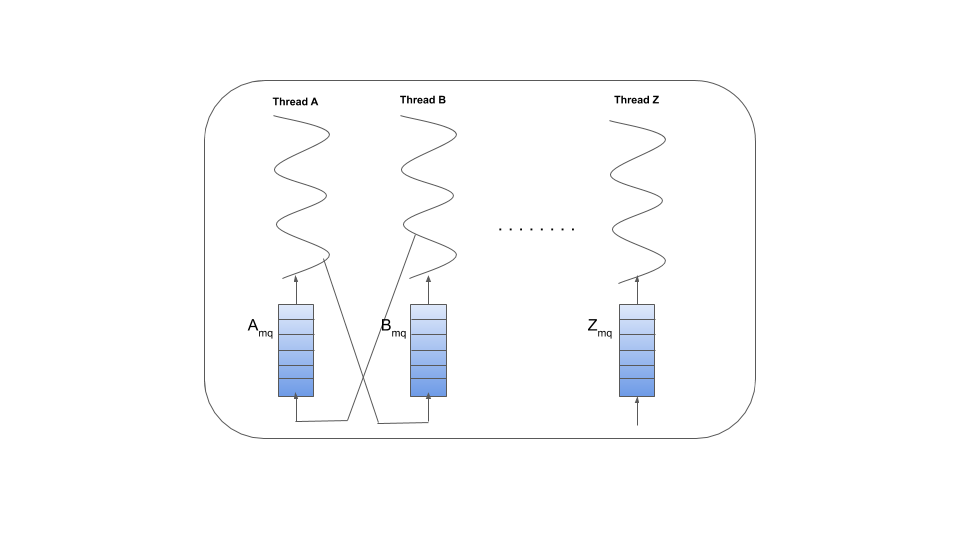

# posix-mq-example

This is a sample repo to demonstrate the usage of posix message queues. Consider an application with multiple threads doing different tasks. Each thread within the app need some form of bi-directional communication to other thread to exchange messages, poll for status etc.

A message queue can be created for each thread to facilitate this form of bi-directional communication. The message queue can be blocking or non-blocking depending on each thread requirements.

A brief description of the files:

- **app_msg.[ch]** includes the wrappers to posix message queue send (`mq_send`) and receive (`mq_receive`) calls to add marshalling and unmarshalling of the messages exchanged. 
- **logger.[ch]** provides basic logging functionality
- **utils.[ch]** has some utility function to measure time in milliseconds, log fatal errors.
- **main.c** - creates two sample threads, **health_checker** and **notifier**. health_checker would periodically check the resource status and send a message to notifier. The notifier thread would receive the message, process it (e.g. send alerts, log etc ) and frees up the message.

To build the code, run `make`. To run the code, run the exectuable `app`.
